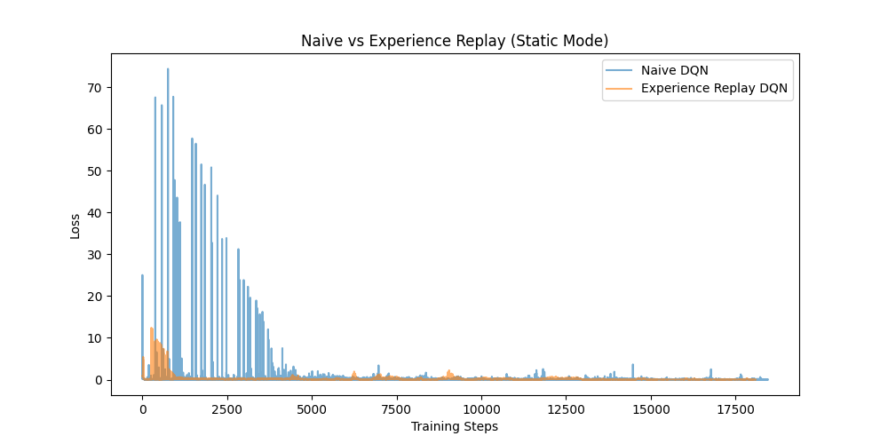
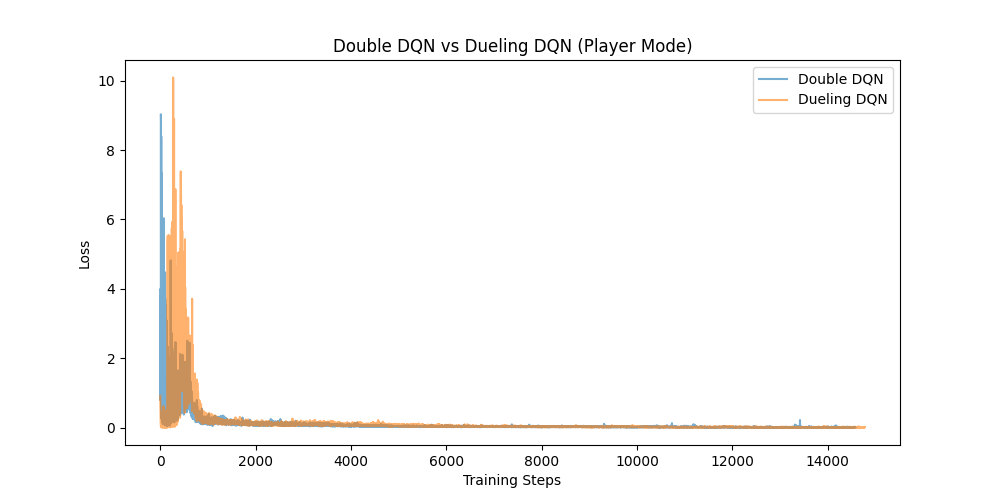
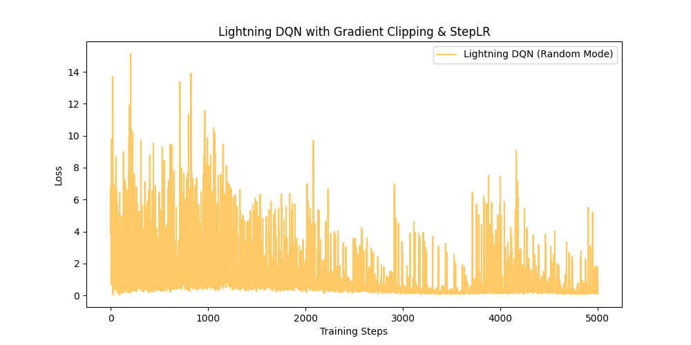
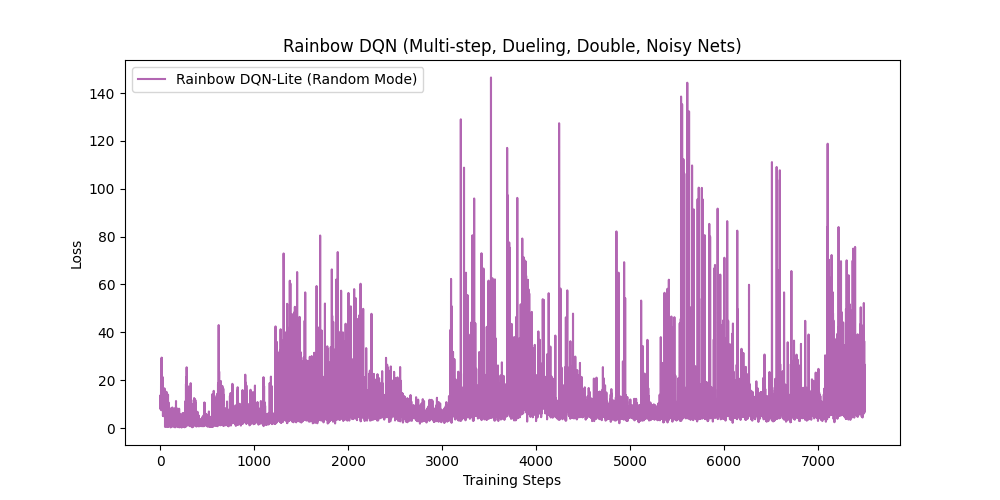

# 📘 Homework 3: DQN and its Variants

此專案為深度強化學習（Deep Reinforcement Learning）第三次作業，主要探討與實作 DQN (Deep Q-Network) 及其多種進階變體。我們使用 `Gridworld` 環境（包含 `static`、`player` 及 `random` 模式）來測試這些演算法的表現與學習穩定性。

🌐 **[點此進入 Interactive Web Demo (GitHub Pages)](https://Hachi282.github.io/0512DRL_HW3/)**，可以直接在瀏覽器中手動操控 Agent 並視覺化理解各演算法的行為差異！

> [!TIP]
> 📜 **AI 協作開發紀錄 (Chat History)**
> 本專案的開發過程（包含除錯、架構決策與與 AI 的討論過程）皆完整記錄於 [chat history.md](chat%20history.md) 中，歡迎助教與老師參閱，以了解本作業的發想與完善過程！

## 🌍 環境介紹: GridWorld (4x4)
本專案使用的環境為一個 4x4 的網格世界，包含四種基本物件：
- **Player (👤)**: Agent 控制的主角。
- **Goal (⭐)**: 目標，抵達可獲得 **+10 分** 並結束回合。
- **Pit (🔥)**: 陷阱，掉入會獲得 **-10 分** 並結束回合。
- **Wall (🧱)**: 障礙物，無法通行。
- **Step Penalty**: 每走一步（包含撞牆停留在原地）都會獲得 **-1 分** 的懲罰，藉此鼓勵 Agent 尋找最短路徑。
- **State Representation**: 狀態被表示為一個 64 維度的扁平化陣列（對應不同物件在 4x4 網格中的位置），並加入微小雜訊防止產生全 0 狀態。
- **Action Space**: 離散的 4 個動作空間（上、下、左、右）。

---

## 📂 作業對照表與實驗宣告

| 作業要求 | 對應檔案 | 環境模式 | 主要實作內容與說明 |
| :--- | :--- | :--- | :--- |
| **HW3-1** | `hw3_1_naive_dqn.py` | Static | 比較 **Naive DQN** (無經驗回放) 與 **Experience Replay DQN**。 |
| **HW3-2** | `hw3_2_enhanced_dqn.py` | Player | 比較 **Double DQN** 與 **單純 Dueling DQN**。 |
| **HW3-3** | `hw3_3_lightning_dqn.py` | Random | 使用 **PyTorch Lightning**，加入 Gradient Clipping 與 StepLR。 |
| **HW3-4** | `hw3_4_rainbow_dqn.py` | Random | 加分題：**Rainbow DQN-Lite** (未實作 PER 與 Distributional RL)。 |

> [!IMPORTANT]
> **實驗設計與實作澄清聲明：**
> 1. **關於 HW3-2 的比較設計**：本實驗是將「純 Double DQN」與「單純 Dueling DQN + 標準 Target Network (未開啟 Double 更新)」做平行效能比較，藉此觀察兩者帶來不同方向的收斂效益，而非探討兩者疊加（Dueling Double DQN）的組合效應。
> 2. **關於 HW3-3 PyTorch Lightning DataLoader**：由於 DQN 的訓練資料是由 Agent 與環境互動時的 Replay Buffer 動態產生，不存在標準的固定 Dataset。因此我們在 Lightning 的實作中使用了一個 Dummy DataLoader 來觸發 Lightning 的迴圈，並由 `training_step` 動態與環境互動。
> 3. **關於 HW3-4 的 Rainbow DQN-Lite**：這是一份部分整合的「縮水版」Rainbow。我們實作了 Multi-step Return、Noisy Nets、Dueling 與 Double 機制；但**尚未實作 Prioritized Experience Replay (PER)** 以及 **Distributional RL**（仍使用 MSE Loss 評估期望值）。

---

## 專案結構與執行說明

請確保環境中已安裝相關套件：
```bash
pip install torch torchvision torchaudio pytorch-lightning numpy matplotlib
```

---

### 🧠 HW3-1: Naive DQN vs. Experience Replay (Static Mode)
**檔案**: `hw3_1_naive_dqn.py`

在完全靜態的 Gridworld 中（所有物件位置固定：Player 在左下，Goal 在左上），比較了原始 DQN 與加入 Experience Replay 的差異。

#### 技術與公式解析
- **Q-Learning 更新公式**:
  神經網路的目標是最小化預測 Q 值與 Target Q 值之間的均方誤差 (MSE Loss)。
  ```math
  L(\theta) = \mathbb{E} \left[ \left( r + \gamma \max_{a'} Q(s', a'; \theta) - Q(s, a; \theta) \right)^2 \right]
  ```
- **Naive DQN**: 採用線上學習（Online Learning）。每走一步就用剛獲得的 $(s, a, r, s')$ 更新模型。由於連續步驟的狀態高度相關，容易導致神經網路訓練發散（Catastrophic Forgetting）。
- **Experience Replay**:
  將所有的 Transition 存入一個容量為 $N$ 的 Buffer 中 $D = \{e_1, \dots, e_N\}$。更新模型時，從 $D$ 中隨機抽取一個 Mini-batch 進行訓練。
  - **優勢**：打破資料的時間相關性（Temporal Correlation），使資料更符合 i.i.d. 假設；並提高資料的使用效率。

#### 訓練參數與實際結果
- **Hyperparameters**: 
  - `gamma` = 0.9, `learning_rate` = 1e-3
  - `epochs` = 1000, `batch_size` = 32, `memory_size` = 1000
  - `epsilon` (探索率) 從 1.0 隨每步衰減至 0.1 (`decay`=0.999)。
- **實際訓練結果 (Loss 與 Reward 雙指標評估)**: 
  - 單看 Loss 下降不代表策略變好，因此我們同時監控了每個回合的 **Total Reward**（滿分 10 分）。
  - Naive DQN 的 Loss 震盪劇烈且不穩定，Reward 也時常無法滿分（陷入陷阱或迷路）。
  - Experience Replay DQN 的 Loss 曲線明顯平滑許多，且 Reward 穩定維持在 10 分左右，證明 Agent 確實學會了找尋最短路徑。
  

---

### ⚖️ HW3-2: Enhanced DQN Variants (Player Mode)
**檔案**: `hw3_2_enhanced_dqn.py`

在「僅玩家起點隨機」的模式下，實作了 Double DQN 與 Dueling DQN 來強化模型的穩定性與收斂速度。

#### 1. Double DQN (DDQN)
傳統 DQN 常因為 $\max_{a'}$ 操作而發生「Q 值高估 (Overestimation Bias)」。DDQN 透過解耦「動作選擇」與「價值評估」來解決此問題：
- **動作選擇**：由 Main Network $\theta$ 決定下一個狀態的最佳動作 $a_{max} = \arg\max_{a'} Q(s', a'; \theta)$
- **價值評估**：由 Target Network $\theta^-$ 來評估該動作的 Q 值。
- **目標公式**:
  ```math
  Y^{DoubleDQN}_t = R_{t+1} + \gamma Q(S_{t+1}, \arg\max_a Q(S_{t+1}, a; \theta_t); \theta^-_t)
  ```

#### 2. Dueling DQN
改變了神經網路的末端架構，將預測拆分為兩條分支：**狀態價值 (State Value, $V$)** 與 **動作優勢 (Advantage, $A$)**。
- **架構公式**:
  ```math
  Q(s, a; \theta, \alpha, \beta) = V(s; \theta, \beta) + \left( A(s, a; \theta, \alpha) - \frac{1}{|\mathcal{A}|} \sum_{a'} A(s, a'; \theta, \alpha) \right)
  ```
- **優勢**：當環境中很多狀態下採取什麼動作並不重要（例如在無障礙的空地），神經網路不需要精確學習每個動作的 Q 值，只需準確評估狀態的價值 $V(s)$ 即可，這大幅加速了訓練。

#### 訓練參數與實際結果
- **Hyperparameters**: 與 HW3-1 相同，另外增加了 `sync_freq` = 50（每 50 步更新一次 Target Network）。
- **實際訓練結果 (Loss 與 Reward 雙指標評估)**: 
  - Double DQN 有效抑制了不尋常的超高 Loss。
  - Dueling DQN 在相同 Epoch 下，由於能更好評估狀態好壞，其 Loss 下降速度與 Reward 上升穩定性通常優於一般架構。在 Reward 曲線上可以明顯看到 Agent 避開陷阱的穩定性提升。
  

---

### 🔁 HW3-3: Enhance DQN for random mode (PyTorch Lightning)
**檔案**: `hw3_3_lightning_dqn.py`

為了應付全隨機（Random Mode）的高難度環境，我們將模型架構轉換為 **PyTorch Lightning**，並引入了以下訓練穩定技術：
- **Gradient Clipping (梯度裁剪)**: 防止在複雜環境下 TD Error 過大導致梯度爆炸。設定 `gradient_clip_val=1.0`。
- **Learning Rate Scheduler (學習率調度器)**: 使用 `StepLR`，每 1000 步將學習率乘上 0.9，讓模型在訓練後期能收斂到更精確的最佳解。

#### 訓練參數與實際結果
- **Hyperparameters**:
  - `learning_rate` = 1e-3, `batch_size` = 32, `memory_size` = 1000.
  - **Learning Rate Scheduler**: `StepLR` (每 1000 步乘以 0.9)。
  - **Gradient Clipping**: `gradient_clip_val=1.0`。
  - **Max Steps**: 5000（模擬約數百個回合）。
- **實際訓練結果 (Loss 與 Reward 雙指標評估)**: 
  - 在全隨機的嚴苛環境下，模型依然能保持穩定的 Loss 衰減而不會發生 NaN 或爆炸的情況。
  - 觀察 Reward 曲線可以發現，Agent 在幾千步後開始穩定獲得正向 Reward，證明 Lightning 架構的訓練穩定性十分優異。
  

---

### 🌈 HW3-4: 加分題 - Rainbow DQN-Lite (Random Mode)
**檔案**: `hw3_4_rainbow_dqn.py` 及 `Report.md`

Rainbow DQN 理論上整合了六大經典改良技術。我們實作了一個「彩虹縮水版 (Lite)」架構，包含了以下核心組件：
1. **Multi-step Return (n-step)**:
   比起只看下一步的 Reward，累積未來 $n$ 步的 Reward 可以加速信號傳遞，減少偏差。
   ```math
   R^{(n)}_t = \sum_{k=0}^{n-1} \gamma^k R_{t+k+1} + \gamma^n \max_{a} Q(S_{t+n}, a; \theta^-)
   ```
2. **Noisy Nets for Exploration**:
   放棄傳統的 $\epsilon$-greedy，改為在神經網路的全連接層權重中加入參數化的雜訊。讓模型自行學習何時該探索、何時該利用。
   ```math
   y = (b + Wx) + (\sigma^b \odot \epsilon^b + (\sigma^w \odot \epsilon^w)x)
   ```
3. **Dueling Architecture** & **Double DQN** 機制整合。

#### 訓練參數與實際結果
- **Hyperparameters**:
  - `n_step` = 3 (Multi-step Return)
  - `std_init` = 0.4 (Noisy Nets 初始雜訊強度)
  - `gamma` = 0.99, `learning_rate` = 1e-3, `epochs` = 300, `batch_size` = 32
- **實際訓練結果 (Loss 與 Reward 雙指標評估)**: 
  - 彩虹縮水版將多種技術整合，Noisy Nets 成功取代了 $\epsilon$-greedy。配合 3-step return，Loss 下降速度在初期非常迅速。
  - Reward 曲線顯示了其強大的學習潛力，在全隨機環境中，Agent 能在極短的 Epoch 內將 Reward 推升，展現了高效率的尋路能力。
  

詳細的理論分析與程式邏輯探討請參考 [Report.md](Report.md)。
